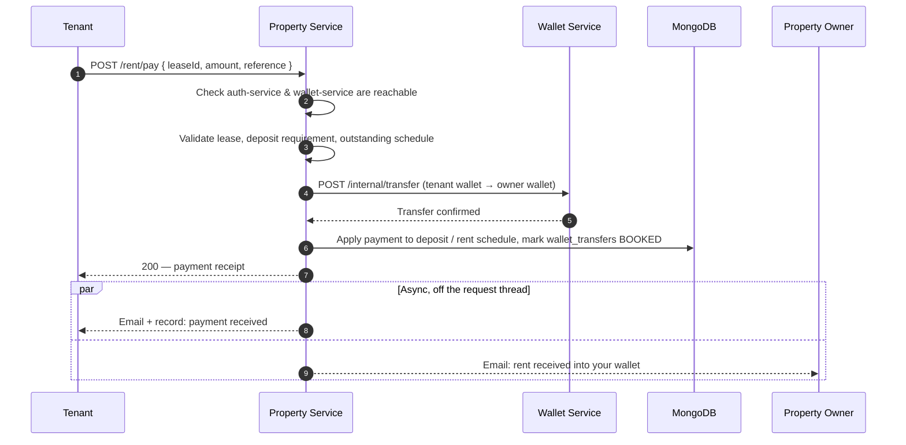

<p align="center">
  
</p>

<h1 align="center">Premisave Property Management Service: Property, Lease &amp; Rent Management API</h1>

<p align="center">
  <b>A production-minded Spring Boot 4 &amp; MongoDB microservice that runs the property, lease, tenant, and rent side of the Premisave platform — with every rent and utility payment settled through the sibling wallet service, never a payment provider directly.</b>
</p>

<p align="center">
  <a href="https://github.com/peacemakerbill">
    
  </a>
  <br/>
  <sub>Built by <a href="https://github.com/peacemakerbill"><b>Bill Graham Peacemaker</b></a> (<code>@peacemakerbill</code>) · Backend Developer &amp; API Support Engineer · Nairobi, Kenya</sub>
</p>

<p align="center">
  
  
  
  
  
  
  
  
</p>

<p align="center">
  
  
  
  
  
</p>

<p align="center">
  <a href="https://github.com/peacemakerbill/premisave-property-management-service/stargazers"></a>
  <a href="https://github.com/peacemakerbill/premisave-property-management-service/network/members"></a>
  <a href="https://github.com/peacemakerbill/premisave-property-management-service/issues"></a>
  <a href="https://github.com/peacemakerbill/premisave-property-management-service/commits"></a>
  
  
  
</p>

<p align="center">
  <a href="#quick-start">Quick start</a> ·
  <a href="#architecture">Architecture</a> ·
  <a href="#how-a-rent-payment-works">How a rent payment works</a> ·
  <a href="#service-availability-and-resilience">Service availability</a> ·
  <a href="#api-reference">API reference</a> ·
  <a href="#configuration-reference">Configuration</a> ·
  <a href="#troubleshooting">Troubleshooting</a>
</p>

> **If this saves you time building a property/lease domain service in Java, please star the repo.** It helps other Kenyan fintech and proptech developers find it.

> **Disclaimer.** This is an independent, community-built project shared as a portfolio and reference implementation. It is not an official product of, and is not affiliated with or endorsed by, Safaricom or any payment provider. This service never talks to M-Pesa, Stripe, PayPal, Flutterwave, or NOWPayments directly — every payment is settled by the sibling [Premisave Wallet Service](https://github.com/peacemakerbill/premisave-wallet-service), which owns that integration surface. M-PESA is a trademark of Safaricom PLC.

---

## Table of contents

1. [What is this?](#what-is-this)
2. [Features](#features)
3. [Architecture](#architecture)
4. [How a rent payment works](#how-a-rent-payment-works)
5. [Service availability and resilience](#service-availability-and-resilience)
6. [Currency and payment model](#currency-and-payment-model)
7. [Quick start](#quick-start)
8. [Build and run](#build-and-run)
9. [Configuration reference](#configuration-reference)
10. [API reference](#api-reference)
11. [Testing with curl](#testing-with-curl)
12. [Data model](#data-model)
13. [Going live](#going-live)
14. [Security notes](#security-notes)
15. [Project structure](#project-structure)
16. [Troubleshooting](#troubleshooting)
17. [Roadmap ideas](#roadmap-ideas)
18. [Contributing](#contributing)
19. [Author](#author)

---

## What is this?

**Premisave Property Management Service** is the property, lease, and tenancy backbone of the Premisave platform: a Java Spring Boot microservice that owns everything about a property from the moment it is listed to the moment a tenant moves out — units, leases, occupancy, rent schedules, security deposits, utility bills, maintenance, and inspections.

It deliberately does **not** own payments. Every rent and utility payment is a wallet-to-wallet transfer, debiting the tenant's Premisave wallet and crediting the property owner's, executed by a single call to the sibling [wallet service](https://github.com/peacemakerbill/premisave-wallet-service)'s internal API. This service:

- models both lease-backed tenancies (with a generated monthly rent schedule) and directly-occupied units (with a running arrears/credit ledger), under one payment API,
- moves money by delegating to the wallet service, never a payment gateway, and never lets a payment request through if the wallet service or auth-service is unreachable,
- makes every payment idempotent by reference, so a retried request after a timeout can never double-charge a tenant,
- sends a fully designed HTML (plus plain-text) email for every payment, deposit, utility bill, and notice, and
- fails fast and clearly — a dependency being down returns a plain-language "service is offline" response instead of a timeout or a stack trace.

It was built for the Premisave platform's own microservice ecosystem (alongside `auth-service` and `wallet-service`), reached by end users via JWT and by sibling services via a shared internal API key.

## Features

| | |
|---|---|
| **Two tenancy models, one payment API** | Lease-backed tenancies (unit or whole-property, with a generated `RentSchedule`) and directly-occupied units (with a running `RentBalance` ledger) share the same payment, deposit, and notice endpoints. |
| **Wallet-funded payments** | Rent and utility bill payments call the wallet service's `/internal/transfer` once, moving money tenant → owner. This service books the payment locally only after that transfer succeeds. |
| **Idempotent by design** | Every payment accepts an optional client reference. A `wallet_transfers` collection (unique-indexed on reference) makes a retried request safe — it is never charged twice, whether the previous attempt succeeded, failed, or timed out. |
| **Service availability checks** | Endpoints that need auth-service or the wallet service check reachability first, and return a friendly, structured 503 — not a hang or a 500 — when a dependency is down. A `GET /system/dependencies` endpoint reports live status for a frontend to poll. |
| **Security deposits with partial refunds** | Deposits are held once per tenancy, with a running refund history; a partial refund requires a reason, a final refund closes the deposit out. |
| **Utility billing from meter readings** | A meter reading can auto-generate a bill using a configured per-unit rate, with duplicate-reading and duplicate-bill guards. |
| **Maintenance → work order pipeline** | A tenant's maintenance request can be turned into an assigned work order, with status kept in sync in both directions. |
| **Bulk & scheduled notices** | Rent reminders and other notices can be sent to many units/leases at once, immediately or at a future time, with per-recipient delivery results and a 24-hour duplicate-notice guard. |
| **Designed HTML email notifications** | Payment receipts, deposit and refund notices, utility bills, failed-payment alerts, and owner-written notices are all sent as branded HTML (Thymeleaf) with a plain-text fallback — no plain default Spring emails. |
| **Owner & tenant "quick" onboarding** | One-click profile creation that pulls name/phone/email straight from the caller's own auth-service account, plus a sync-status check so the frontend can prompt "your profile changed — sync now?". |
| **Dual authentication model** | JWT for end users (via a shared secret with auth-service), a shared internal API key for service-to-service calls from the rest of the Premisave ecosystem. |
| **OpenAPI 3 documentation** | Full API spec generation via springdoc-openapi. |

## Architecture

```
┌──────────────┐      JWT       ┌────────────────────────┐
│   End User   │ ─────────────► │                        │
└──────────────┘                │                        │      ┌─────────────────┐
                                 │  Premisave Property     │ ───► │  auth-service   │  profile lookups,
┌──────────────┐  X-API-Key     │  Management Service     │ ◄─── │                 │  quick-create/sync
│ sibling svcs │ ◄────────────► │   (this repository)     │      ├─────────────────┤
└──────────────┘                │                        │ ───► │  wallet-service │  /internal/transfer
                                 │  MongoDB · Redis        │      │                 │  (rent & bill payments)
                                 │  RabbitMQ · Mail (SMTP) │      ├─────────────────┤
                                 │                        │ ───► │ listing-service │  property sync
                                 │                        │ ───► │ booking-service │  unit availability
                                 └────────────────────────┘      └─────────────────┘
```

**Design choices**

- **This service never touches a payment gateway.** A rent or utility payment is a single, idempotent call to the wallet service's `/internal/transfer` — M-Pesa, Stripe, PayPal, Flutterwave, and crypto are entirely the wallet service's concern.
- **A dependency being down is a first-class, user-facing state, not a stack trace.** Payment and profile endpoints declare which services they need; if one is unreachable, the caller gets a clear 503 with a retryable reference, before any validation or database write happens.
- **The owner's wallet account is resolved server-side, never trusted from the request.** It comes from auth-service via the owner's own `userId`, not from a freely-editable email field on the owner's profile — so a payment can never be misdirected to the wrong wallet.
- **Two tenancy shapes, one mental model.** A lease-backed tenancy and a directly-occupied unit differ in how "what's owed" is derived (a generated schedule vs. a running balance), but share the same payment request shape, the same deposit rules, and the same notice endpoints.

## How a rent payment works



If the wallet service can't be reached, or the transfer's outcome can't be confirmed, the request fails **before** any local record is booked — the response tells the tenant plainly that nothing was charged, or gives back the same `reference` to safely retry. The same shape covers direct-unit rent payments and utility bill payments, against a running balance and a bill's paid-so-far total respectively, instead of a generated schedule.

## Service availability and resilience

Every endpoint that depends on auth-service or the wallet service is annotated to declare that dependency. Before the request does anything else, a background health monitor's cached status is checked:

- **A service counts as online** if its health path answers with anything other than a gateway-style 502/503/504 — even a 401 or 404 proves it is alive, so a protected or missing health path is not mistaken for an outage.
- **Results are cached** (30 seconds when up, 3 seconds when down, refreshed every 10 seconds in the background), so a busy endpoint almost never waits on a live probe, and a real request that fails to connect marks the service down immediately.
- **A dependency being down never surfaces as a 500 or a hang.** The response is a 503 with a plain-language message (for example, *"We can't process payments right now because our wallet is offline. Nothing has been charged."*), a `retryAfterSeconds`, and, for payments, the reference to retry with.
- **`GET /system/dependencies`** reports live per-service status, so a frontend can grey out a "Pay rent" button before the tenant ever taps it.

## Currency and payment model

- **USD is the only currency this service ever records**, matching the wallet service's own USD-denominated wallets — a rent amount, a utility rate, and a deposit are all plain USD figures.
- **This service moves no money itself.** A payment request results in exactly one wallet-service transfer call; this service only ever books the *result* of that transfer against a lease, a unit's balance, a deposit, or a bill.
- **Idempotency**: every payment accepts an optional caller-supplied `reference`. Retrying with the same one is guaranteed safe — it returns the original result rather than moving money again — tracked via a unique-indexed `wallet_transfers` collection.

## Quick start

### Prerequisites

- **Java 21**
- **Maven 3.9+**
- **MongoDB** running locally, in Docker, or on Atlas
- **Redis** running locally or hosted (used for `@EnableCaching`)
- **RabbitMQ** running locally or hosted
- The sibling [**auth-service**](https://github.com/peacemakerbill/premisave_auth_service) and [**wallet-service**](https://github.com/peacemakerbill/premisave-wallet-service) running, or their `/health`-style endpoints reachable — otherwise payment and profile-sync endpoints will correctly, but visibly, answer 503

```bash
# 1. Clone
git clone https://github.com/peacemakerbill/premisave-property-management-service.git
cd premisave-property-management-service

# 2. Start MongoDB, Redis, and RabbitMQ (skip any you already have)
docker run -d --name property-mongo -p 27017:27017 mongo:8
docker run -d --name property-redis -p 6379:6379 redis:7
docker run -d --name property-rabbitmq -p 5672:5672 rabbitmq:4-management

# 3. Create your .env (see the next section), then run
mvn spring-boot:run
```

Create a `.env` file next to `pom.xml`:

```properties
# Core
MONGODB_URI=mongodb://localhost:27017/premisave-property
REDIS_HOST=localhost
REDIS_PORT=6379
RABBITMQ_HOST=localhost
JWT_SECRET=<a long, random secret shared with auth-service>
INTERNAL_API_KEY=<a shared secret, identical across every Premisave microservice>

# Sibling services
AUTH_SERVICE_URL=http://localhost:8080
WALLET_SERVICE_URL=http://localhost:8084
LISTING_SERVICE_URL=http://localhost:8082
BOOKING_SERVICE_URL=http://localhost:8083

# Outgoing email (payment receipts, deposit/bill notices, owner notices)
MAIL_USERNAME=...
MAIL_PASSWORD=...
NOTICE_EMAIL_FROM=no-reply@premisave.com

# Utility billing rates (USD per unit of metered consumption)
UTILITY_RATE_ELECTRICITY=0.15
UTILITY_RATE_WATER=1.50
```

> **Important:** write `.env` values without quotes and without trailing spaces. `INTERNAL_API_KEY` must be byte-for-byte identical to the value configured in auth-service and wallet-service — a mismatch shows up as 401s on every internal call, not a startup error.

When the service is healthy you will see lines like:

```
Tomcat started on port 8085 (http) with context path '/'
Monitor thread successfully connected to server with description ServerDescription{address=localhost:27017, ...}
Started PremisavePropertyManagementApplication in 5.6 seconds
```

## Build and run

```bash
# Compile and package an executable jar
mvn clean package

# Run it (environment variables or a .env in the working directory)
java -jar target/premisave-property-management-service-0.0.1-SNAPSHOT.jar
```

**Notes**

- `.env` is loaded from the working directory. Real environment variables (Docker, Kubernetes, systemd) also work and take precedence over `.env`.
- The service starts on **port 8085** by default (`server.port` in `application.yml`).
- Set `SERVICE_HEALTH_CHECKS_ENABLED=false` to switch off the auth-service/wallet-service reachability checks entirely — useful for isolated local testing, at the cost of payment requests going back to hanging or erroring against a dead dependency instead of failing fast.

## Configuration reference

Every setting lives in `src/main/resources/application.yml` and can be overridden by an environment variable or `.env`.

| Environment variable | Default | Required | Description |
|---|---|---|---|
| `MONGODB_URI` | `mongodb://localhost:27017/premisave-property` | no | MongoDB connection string. |
| `REDIS_HOST` / `REDIS_PORT` | `localhost` / `6379` | no | Redis connection, backing `@EnableCaching`. |
| `RABBITMQ_HOST` / `RABBITMQ_PORT` | `localhost` / `5672` | no | RabbitMQ connection. |
| `JWT_SECRET` | dev default | **yes in production** | Must match every other Premisave service validating the same tokens. |
| `INTERNAL_API_KEY` | none | **yes** | Shared secret this service presents as `X-API-Key` to auth-service and wallet-service, and expects from sibling services calling in. |
| `AUTH_SERVICE_URL` | `http://localhost:8080` | no | Base URL of auth-service. |
| `WALLET_SERVICE_URL` | `http://localhost:8084` | no | Base URL of the wallet service; every rent/utility payment goes through its `/internal/transfer`. |
| `LISTING_SERVICE_URL` / `BOOKING_SERVICE_URL` | `http://localhost:8082` / `8083` | no | Base URLs of the listing and booking services. |
| `SERVICE_HEALTH_CHECKS_ENABLED` | `true` | no | Turns the auth-service/wallet-service reachability checks on or off. |
| `AUTH_SERVICE_HEALTH_PATH` / `WALLET_SERVICE_HEALTH_PATH` | `/health` / `/system/health` | no | Health path probed on each dependency. |
| `MAIL_HOST` / `MAIL_PORT` / `MAIL_USERNAME` / `MAIL_PASSWORD` | `smtp.gmail.com` / `587` / — / — | **yes, for email** | SMTP credentials for outgoing notifications. |
| `NOTICE_EMAIL_FROM` / `NOTICE_EMAIL_FROM_NAME` | `no-reply@premisave.com` / `Premisave` | no | From address and display name on every outgoing email. |
| `SUPPORT_EMAIL` | `support@premisave.com` | no | Shown as the contact address in every email footer. |
| `UTILITY_RATE_ELECTRICITY` / `UTILITY_RATE_WATER` | — | no | USD charged per unit of metered consumption when auto-generating a bill from a meter reading. |
| `FRONTEND_URL` | `http://localhost:3000` | no | Used as the link behind every email's call-to-action button. |

The service **starts with a warning** if `INTERNAL_API_KEY` or `JWT_SECRET` are left blank — treat both as required outside local development.

## API reference

Base URL (local): `http://localhost:8085`

| Namespace | Auth | Purpose |
|---|---|---|
| `/api/v1/properties/**`, `/api/v1/units/**` | JWT (owner-only for writes) | Properties and rental units |
| `/api/v1/leases/**`, `/api/v1/occupancy/**` | JWT | Leases and move-in/move-out history |
| `/api/v1/owners/**`, `/api/v1/tenants/**` | JWT | Owner and tenant profiles, including one-click create/sync |
| `/api/v1/rent/**` | JWT | Lease-backed and direct-unit rent payments, balances, and schedules |
| `/api/v1/security-deposits/**` | JWT | Deposit hold, refund, and refund-preview |
| `/api/v1/utility-bills/**`, `/api/v1/meter-readings/**` | JWT | Utility billing and meter readings |
| `/api/v1/maintenance/**`, `/api/v1/work-orders/**`, `/api/v1/inspections/**` | JWT | Maintenance requests, work orders, inspections |
| `/api/v1/notices/**` | JWT (owner-only for bulk) | Single, bulk, and scheduled notices |
| `/api/v1/blacklisted-tenants/**` | JWT | Tenant blacklist |
| `/api/v1/dashboard/**`, `/api/v1/reports/**` | JWT (owner) | Owner dashboard and occupancy/revenue reports |
| `/system/**` | Mixed | Health checks and `GET /system/dependencies` |

### `POST /api/v1/rent/pay`: pay rent on a lease

| | |
|---|---|
| **Header** | `Authorization: Bearer <JWT>` |

Request:

```json
{
  "leaseId": "6a30a1b2c3d4e5f607182930",
  "amount": 500.00,
  "paymentMethod": "WALLET",
  "reference": "rent-sep-2026"
}
```

Response (`200`):

```json
{
  "id": "6a31b7c8d9e0f1a2b3c4d5e6",
  "leaseId": "6a30a1b2c3d4e5f607182930",
  "paymentType": "RENT",
  "amount": 500.00,
  "rentAmountApplied": 500.00,
  "depositAmountApplied": 0,
  "status": "PAID",
  "paymentMethod": "WALLET",
  "paymentReference": "PRP-<tenantId>-rent-sep-2026",
  "paidAt": "2026-09-19T15:42:10.482"
}
```

`paymentMethod` accepts only `WALLET` (or omitted) — wallets are topped up with M-Pesa/Stripe/etc. in the wallet service, not here. `reference` is optional but strongly recommended: reusing it on retry never double-charges.

### `POST /api/v1/rent/units/pay`: pay rent on a directly-occupied unit

Same shape as above, with `rentalUnitId` in place of `leaseId`; the response carries `resultingBalance` (positive = arrears remain, negative = the tenant is in credit) instead of a rent-schedule breakdown.

### `POST /api/v1/utility-bills/pay`: pay a utility bill

| | |
|---|---|
| **Header** | `Authorization: Bearer <JWT>` |

```json
{
  "billId": "6a3122b3c4d5e6f708192a3b",
  "amount": 30.00,
  "paymentMethod": "WALLET",
  "reference": "elec-sep-2026-1"
}
```

### `GET /system/dependencies`: live status of auth-service and wallet-service

| | |
|---|---|
| **Header** | `Authorization: Bearer <JWT>` |

```json
{
  "status": "DEGRADED",
  "services": {
    "auth-service":   { "name": "Authentication service", "status": "UP" },
    "wallet-service": { "name": "Premisave Wallet",       "status": "DOWN" }
  },
  "timestamp": "2026-09-22T21:01:15.556234"
}
```

## Testing with curl

```bash
BASE=http://localhost:8085
TOKEN="<a real JWT for a test user>"

# Check dependency status before attempting a payment
curl -s -H "Authorization: Bearer $TOKEN" "$BASE/system/dependencies"

# Pay rent on a lease
curl -s -X POST "$BASE/api/v1/rent/pay" \
  -H "Authorization: Bearer $TOKEN" \
  -H "Content-Type: application/json" \
  -d '{"leaseId":"<lease id>","amount":500.00,"paymentMethod":"WALLET","reference":"rent-test-1"}'

# Check what a tenant currently owes on a lease
curl -s -H "Authorization: Bearer $TOKEN" "$BASE/api/v1/rent/due/<lease id>"

# One-click owner profile creation, pulled from the caller's own auth-service account
curl -s -X POST "$BASE/api/v1/owners/quick" -H "Authorization: Bearer $TOKEN"
```

**Variables worth saving in Postman:** `base_url_property`, `token`, `lease_id`, `rental_unit_id`, `unit_id`, `payment_reference`, `internal_api_key`.

## Data model

Selected MongoDB collections and the fields most integration partners need:

| Collection | Purpose |
|---|---|
| `properties` / `rental_units` | A property and its individual rentable units, with occupancy status. |
| `owners` / `tenants` | Profiles synced from auth-service, plus property-domain-specific fields (bank details, current address, blacklist flag). |
| `leases` | `leaseType` (`UNIT` or `WHOLE_PROPERTY`), term, monthly rent, and status. |
| `rent_schedules` | One generated row per billing period of a lease, with amount due/paid and status. |
| `rent_balances` | A running arrears/credit ledger for directly-occupied (no-lease) units. |
| `lease_rent_unit_payments` / `unit_rent_payments` | Every rent payment transaction, carrying the wallet-service `paymentReference` that ties it back to the money movement. |
| `security_deposits` | One deposit per tenancy, with an embedded refund history. |
| `utility_bills` / `meter_readings` | Metered consumption and the bills generated from it. |
| `maintenance_requests` / `work_orders` | A tenant's request and the assigned work carried out against it. |
| `inspections` | Scheduled and completed property inspections, with or without a system-account inspector. |
| `notices` / `scheduled_notices` | Individual and bulk/scheduled tenant communications, with per-recipient delivery results. |
| `occupancy_history` | Every move-in/move-out, lease-backed or direct. |
| `wallet_transfers` | The idempotency ledger for every payment this service has asked the wallet service to move — what makes retries safe. |
| `blacklisted_tenants` / `audit_logs` | Tenant blacklist entries and a general-purpose audit trail. |

## Going live

1. **Confirm `INTERNAL_API_KEY` and `JWT_SECRET`** are strong, and identical to the values configured in auth-service and wallet-service.
2. **Point `AUTH_SERVICE_URL` and `WALLET_SERVICE_URL`** at their real, network-reachable addresses, and confirm each one's health path (`AUTH_SERVICE_HEALTH_PATH`, `WALLET_SERVICE_HEALTH_PATH`) is reachable from this service.
3. **Set real `UTILITY_RATE_*` values** — the defaults are placeholders and will misprice any bill generated from a meter reading until set.
4. **Confirm outgoing email** works end-to-end (a payment, a deposit, and a notice) against your real SMTP credentials before relying on it for tenant communication.
5. **Decide on `SERVICE_HEALTH_CHECKS_ENABLED`** deliberately — leaving it `true` (the default) is almost always right in a real deployment, since it is what turns a dead dependency into a clear 503 instead of a hang.

## Security notes

- **JWT authentication** for all end-user-facing endpoints, validated against the platform's shared secret.
- **Internal API key authentication** (`X-API-Key`) for service-to-service calls, kept entirely separate from user JWTs.
- **Method-level authorization** (`@PreAuthorize`) restricts owner-only actions (creating a property, bulk notices, dashboard/reports) to the `HOME_OWNER` role.
- **The property owner's wallet destination is never taken from the request or from a freely-edited profile field** — it is resolved from auth-service via the owner's own `userId` at payment time.
- **Every payment is idempotent by reference**, closing off retry-driven double-charging as a failure mode entirely.
- **Stateless sessions** — no server-side session state, fully horizontally scalable.

## Project structure

```
premisave-property-management-service/
├── src/main/java/com/premisave/property/
│   ├── config/          # Security, Mongo, Redis, RabbitMQ, CORS, Async, Feign, OpenAPI
│   ├── client/           # Feign clients: auth-service, wallet-service, listing-service, booking-service
│   ├── controller/       # REST controllers
│   ├── service/          # Domain services (one per aggregate) + WalletPaymentService, PaymentNotificationService
│   ├── health/           # ServiceHealthMonitor, @RequiresServices, the offline-check interceptor
│   ├── dto/               # Request/response DTOs
│   ├── entity/            # MongoDB documents
│   ├── repository/        # Spring Data MongoDB repositories
│   ├── security/          # JWT filter & service
│   ├── exception/         # Domain exceptions + GlobalExceptionHandler
│   └── PremisavePropertyManagementApplication.java
├── src/main/resources/
│   ├── application.yml
│   └── templates/email/   # Thymeleaf HTML email templates
└── pom.xml
```

## Troubleshooting

<details>
<summary><b>App fails to start: "No qualifying bean of type 'CacheManager' available"</b></summary>

`@EnableCaching` (in `CacheConfig`) has nothing to bind to unless `spring-boot-starter-cache` is on the classpath alongside `spring-boot-starter-data-redis` — having Redis alone is not enough. Add `spring-boot-starter-cache` to `pom.xml`.
</details>

<details>
<summary><b>App fails to start: "No qualifying bean of type 'com.fasterxml.jackson.databind.ObjectMapper' available"</b></summary>

Something is asking Spring to inject a Jackson 2 `ObjectMapper` bean. Under Jackson 3 (the default), Spring no longer auto-configures one. If the usage is a narrow, internal JSON parse rather than the app's actual HTTP message conversion, construct a plain `new ObjectMapper()` locally instead of requesting one from the container.
</details>

<details>
<summary><b>A payment returns 503 with "service is offline" even though the dependency looks fine</b></summary>

Check `AUTH_SERVICE_HEALTH_PATH` / `WALLET_SERVICE_HEALTH_PATH` actually resolve against the configured base URL, and that the target answers something other than 502/503/504 — any other status, including 401/404, is treated as "online". A connection refused, DNS failure, or timeout is what actually trips the check.
</details>

<details>
<summary><b>A payment returns 503 saying it couldn't be confirmed, with a reference to retry</b></summary>

This means the wallet-service call either timed out or the connection was lost mid-request — the outcome is genuinely unknown from this service's side. Retry the exact same request with the `reference` given in the error; the `wallet_transfers` ledger guarantees it will not charge the tenant twice, whichever way the first attempt actually landed.
</details>

<details>
<summary><b>MongoDB connects to the wrong database, or the URI seems to be ignored</b></summary>

Confirm the property is `spring.mongodb.uri`, not `spring.data.mongodb.uri` — Spring Boot 4 moved MongoDB's connection properties out of the Spring Data namespace into their own `spring.mongodb.*` prefix.
</details>

## Roadmap ideas

Real, currently-known gaps and follow-ups, not commitments:

- [ ] Security deposit refunds are recorded locally but do not yet move money out of the owner's wallet — a refund still needs to be settled outside this service
- [ ] The standalone `POST /security-deposits` endpoint books a deposit with no corresponding wallet transfer, separate from the wallet-funded flow used by rent payments
- [ ] Manual/cash rent recording is no longer supported now that payments are wallet-only — an owner cannot log an off-platform payment
- [ ] A known upstream Spring Framework 7 issue (spring-framework#35287) can turn a method-level `@PreAuthorize` denial into a 500 instead of a 403 — worth a regression test once a fix ships
- [ ] RabbitMQ queues are declared (`property.auth.queue`, `property.wallet.queue`, `property.booking.queue`) ahead of an event-driven flow that isn't wired up yet
- [ ] `listing-service` and `booking-service` Feign clients exist but their call sites (property→listing sync, unit availability checks) are not yet exercised end-to-end

## Contributing

This is a proprietary service for the Premisave platform. If you have been granted access to contribute:

1. Fork the repository and create a branch: `git checkout -b feature/my-improvement`
2. Make your change and keep the code style consistent.
3. Commit with a clear message and open a pull request describing what and why.

Found a bug or have an integration question? [Open an issue](https://github.com/peacemakerbill/premisave-property-management-service/issues).

## Author

<table>
  <tr>
    <td align="center" width="180">
      <a href="https://github.com/peacemakerbill">
        <br/>
        <sub><b>Bill Graham Peacemaker</b></sub>
      </a>
    </td>
    <td>
      <b>Backend Developer &amp; API Support Engineer at Safaricom PLC</b><br/>
      Nairobi, Kenya<br/><br/>
      Enterprise systems developer and API integration specialist, working across backend microservices (Java/Spring Boot), Flutter frontends, and DevOps — with deep, hands-on production and personal-project experience in Safaricom's M-Pesa Daraja APIs.<br/><br/>
      <a href="https://github.com/peacemakerbill"></a>
      <a href="https://github.com/peacemakerbill?tab=followers"></a>
      <br/><br/>
      More from me: <a href="https://github.com/peacemakerbill/premisave-wallet-service">premisave-wallet-service</a> ·
      <a href="https://github.com/peacemakerbill/premisave-c2b-hakikisha-service-m-pesa">premisave-c2b-hakikisha-service-m-pesa</a> ·
      <a href="https://github.com/peacemakerbill/premisave_auth_service">premisave_auth_service</a> ·
      <a href="https://github.com/peacemakerbill/premisave_flutter_frontend">premisave_flutter_frontend</a> ·
      <a href="https://github.com/peacemakerbill?tab=repositories">all repositories</a>
    </td>
  </tr>
</table>

### Star history

<a href="https://star-history.com/#peacemakerbill/premisave-property-management-service&Date">
  
</a>

---

<details>
<summary>Search keywords</summary>

Spring Boot microservice · Java property management backend · lease management API Java · rent payment system · tenant management microservice · property management SaaS backend · wallet-funded payments Java · microservice-to-microservice payments · idempotent payment processing · service availability circuit breaker Spring · MongoDB Spring Boot microservice · Spring Data MongoDB · Redis caching Spring Boot · RabbitMQ Spring Boot · JWT authentication Spring Security 7 · Spring Boot 4 · Spring Framework 7 · OpenFeign service-to-service · security deposit management · utility billing from meter readings · maintenance work order system · property inspection scheduling · fintech backend Kenya · proptech Kenya · East Africa payments infrastructure · Premisave · Thymeleaf HTML email notifications

</details>

<p align="center">
  <sub>Made in Nairobi, Kenya · <a href="https://github.com/peacemakerbill">@peacemakerbill</a></sub>
</p>